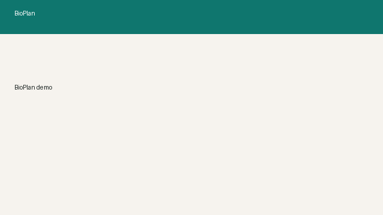

# BioPlan

**Контроль проектной деятельности с ИИ-ассистентом.**

Иерархический план-график (Gantt), исполнители и сроки, Excel и чат на естественном языке: ассистент меняет план через те же MCP-tools, что доступны из Cursor. Разворачивается на **Ubuntu-сервере** или на **Windows-ПК** (локально в браузере).



Репозиторий: https://github.com/Kexiq-droid/AI-gantt

## Что умеет

- План проекта на Gantt: фазы и задачи, zoom (дни / недели), линия «Сегодня»
- Прогресс `%`, карточка задачи (описание, исполнитель, длительность)
- ИИ-ассистент в чате: сдвиги сроков, назначения, зависимости, новые задачи, анализ загрузки
- Undo / Redo, кнопка «Сбросить демо», журнал ассистента
- Импорт и экспорт Excel

Для работы ассистента достаточно **DeepSeek V4 Flash** — более тяжёлая модель не нужна.

## Требования

| | Ubuntu / Linux | Windows |
|--|----------------|---------|
| Python | 3.11+ | 3.11+ ([python.org](https://www.python.org/downloads/)) |
| Node.js | 20+ | 20+ ([nodejs.org](https://nodejs.org/)) |
| Прочее | `git`, `make` (удобно) | `git`; команды ниже без `make` |

## Быстрый старт — Windows

В PowerShell из каталога клона:

```powershell
git clone https://github.com/Kexiq-droid/AI-gantt.git
cd AI-gantt
copy .env.example .env
# опционально: откройте .env и впишите DEEPSEEK_API_KEY=...

python -m venv .venv
.\.venv\Scripts\Activate.ps1
pip install -U pip
pip install -r backend\requirements.txt

$env:PYTHONPATH = (Get-Location).Path
python -m backend.app.seed_cli

cd frontend
npm install
npm run build
cd ..

uvicorn backend.app.main:app --host 127.0.0.1 --port 8100
```

Откройте http://127.0.0.1:8100

Если PowerShell блокирует скрипты активации venv:  
`Set-ExecutionPolicy -Scope CurrentUser RemoteSigned`

## Быстрый старт — Ubuntu / Linux

```bash
git clone https://github.com/Kexiq-droid/AI-gantt.git
cd AI-gantt
cp .env.example .env
# опционально: в .env укажите DEEPSEEK_API_KEY=...

make backend-install
. .venv/bin/activate
make seed
make build
make up                 # http://127.0.0.1:8100
```

Без `make` — те же шаги, что на Windows, с `python3` / `.venv/bin/activate` / `export PYTHONPATH=$PWD`.

## Вход

| Логин | Пароль | Роль |
|-------|--------|------|
| `pm` | `pm12345` | editor |

После `seed` загружается демо-план **VAX-B** (пример проектного пайплайна). Свой план — импорт Excel или создание задач в UI / чате.

Пример файла: [examples/plan_vax_b_demo.xlsx](examples/plan_vax_b_demo.xlsx).

Без ключа LLM работают Gantt, Excel и undo; чат сообщит, что ассистент недоступен.  
Для локального HTTP оставьте `COOKIE_SECURE=false` (как в `.env.example`).

### Проверка за 3 минуты

1. Войти как `pm` → на диаграмме план VAX-B.
2. Импорт Excel при желании: `examples/plan_vax_b_demo.xlsx`.
3. В чат: `Сдвинь всю доклинику на 10 дней и назначь Иванова на все задачи фазы CMC`.
4. Дождаться ответа → подсветка изменённых задач.
5. **← Отменить** / **Экспорт Excel**.

Сценарий записи ролика: [docs/DEMO.md](docs/DEMO.md).

## Настройка ИИ (`.env`)

Рекомендуемый простой вариант — DeepSeek:

```env
LLM_PROVIDER=deepseek
DEEPSEEK_API_KEY=sk-...
DEEPSEEK_MODEL=deepseek-v4-flash
```

Альтернативы: `timeweb` (OpenAI-compatible gateway), `openai`.  
После смены `.env` перезапустите процесс uvicorn (на сервере со systemd — `systemctl restart bioplan-api`).

## Ubuntu-сервер (постоянный запуск)

Кратко:

1. Клон + `.env` с `COOKIE_SECURE=true` и вашими `CORS_ORIGINS` (HTTPS-домен).
2. `make backend-install && make seed && make build`.
3. systemd-юнит на `uvicorn` (порт 8100) + nginx (TLS → static/`/api`).

Подробности: [docs/RUNBOOK.md](docs/RUNBOOK.md).

## Архитектура

```
Браузер (SPA)  -->  FastAPI (auth, план, Excel, чат, jobs)
                       |-- validate + apply_plan_patch (атомарно)
                       |-- ассистент: rules и/или LLM → MCP tools
                       `-- SQLite (файл в data/)

mcp_server/  — те же tools по stdio для Cursor
```

Инварианты: уникальные коды; валидный parent без циклов; FS без циклов; duration > 0 у листьев; запись в план только после validate.

## MCP из Cursor

Web-чат и Cursor используют одну tool surface (`backend/app/services/mcp_runtime.py`).

```json
{
  "mcpServers": {
    "bioplan": {
      "command": "C:/path/to/AI-gantt/.venv/Scripts/python.exe",
      "args": ["-m", "mcp_server"],
      "cwd": "C:/path/to/AI-gantt",
      "env": {
        "PYTHONPATH": "C:/path/to/AI-gantt",
        "BIOPLAN_MCP_USER": "pm"
      }
    }
  }
}
```

На Linux замените `command` на `/path/to/AI-gantt/.venv/bin/python`.

**Tools:** `get_plan_snapshot`, `validate_plan`, `apply_plan_patch`, `undo_plan`, `list_overloaded_assignees`  
**Resource:** `plan://current`

## Makefile (Linux)

| Команда | Действие |
|---------|----------|
| `make backend-install` | venv + зависимости Python |
| `make seed` | пользователь `pm` + демо-план |
| `make build` | сборка frontend |
| `make up` | build + uvicorn :8100 |
| `make test` | pytest |

## Примеры команд ассистенту

1. Сдвинь всю доклинику на 10 дней  
2. Назначь Иванова на все задачи фазы CMC  
3. Добавь задачу «Резервный анализ антигена» в доклинику на 5 дней после T2.3  
4. Отмени последнее  
5. Кто перегружен по числу задач?

Полный список — в [TECHNICAL_SPEC.md](TECHNICAL_SPEC.md) (golden prompts).

## Документы

- [TECHNICAL_SPEC.md](TECHNICAL_SPEC.md) — исходное ТЗ + блок «Статус сдачи»  
- [ROADMAP_TO_PRODUCTION.md](ROADMAP_TO_PRODUCTION.md) — путь к пилоту: Now → Next → Later  
- [docs/DECISIONS.md](docs/DECISIONS.md) — архитектурные решения  
- [docs/RUNBOOK.md](docs/RUNBOOK.md) — эксплуатация на сервере  
- [docs/DEMO.md](docs/DEMO.md) — сценарий демо-ролика  
- [examples/plan_vax_b_demo.xlsx](examples/plan_vax_b_demo.xlsx) — пример плана  

## Как использовались AI-ассистенты

- **Cursor** — каркас FastAPI/React, UI, Excel, агент, MCP, деплой и документация.  
- Контракт tools и инварианты зафиксированы в `TECHNICAL_SPEC.md`.  
- Качество агента: журнал (`/api/agent/*`), pytest, прогон команд на стенде.
