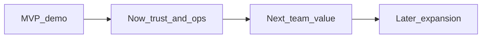

# Roadmap to production

Путь от демо-стенда BioPlan к пилоту во внутренней команде: сначала доверие и эксплуатация, потом масштаб и продуктовые расширения.

Документ для ревьюера / техлида. Читается за ~3 минуты и отвечает на три вопроса: какие риски демо мы признаём, в каком порядке их закроем, что сознательно не берём в scope.

## Контекст

**Сейчас (MVP):** React SPA + FastAPI + SQLite + agent jobs в процессе uvicorn + внешний LLM + общая MCP tool surface (web и Cursor). Один план на пользователя, демо-сид VAX-B, journal агента, undo, Excel, validate-before-apply.

**Цель production:** внутренний инструмент **контроля проектов** с AI-правками плана, которым можно пользоваться команде без «демо на одном VPS».

**Критерий «готово к пилоту»:**

- данные переживают рестарт и бэкап восстанавливается;
- агент не меняет план без валидации и не делает вид, что «готово», когда патч отвергнут;
- есть роли доступа и аудит «кто / что / когда»;
- агента можно отключить без деплоя;
- команда из нескольких людей может работать с несколькими проектами без общих demo-паролей.

---

## Now — закрыть риски MVP

Без этого пилот опасен. Горизонт: 1–2 спринта после решения «идём в пилот».

| Риск MVP | Что сделать | Готово когда |
|----------|-------------|--------------|
| SQLite, один файл, один хост | Postgres + Alembic + регулярные бэкапы (и проверка restore) | миграции в CI; restore с бэкапа прогнан на staging |
| Jobs внутри uvicorn | Очередь + отдельный worker (Arq/RQ/Celery); ретраи LLM с backoff | job переживает рестарт API; идемпотентность по `job_id` |
| Данные плана уходят во внешний LLM | Корпоративный gateway / allowlist полей; kill-switch агента | агент выключается флагом/конфигом без деплоя |
| Слабый доступ | Нормальные пароли или SSO (OIDC); роли `editor` / `viewer` / `admin` | нет общих demo-учёток в проде |
| Слабые доказательства | Immutable audit trail правок UI и tool-calls (опираться на journal) | любая мутация плана трассируется |

**Также в Now (качество и сигналы):**

- CI: pytest + smoke по golden prompts (с тестовым ключом или mocked LLM);
- один Playwright e2e по happy-path (логин → правка → undo);
- алерты по `/api/health` и failed jobs.

Роль `viewer` (read-only) и single-flight jobs на план в коде уже есть — в проде это нужно включить в нормальную модель пользователей, а не оставлять как демо-заготовку.

---

## Next — сделать полезным команде

Только после Now. Иначе новые фичи сядут на хрупкий фундамент.

- **Несколько проектов / планов** на организацию (не один план на `user_id`).
- **Справочник исполнителей** вместо свободной строки + понятная загрузка / «кто перегружен».
- **Календарь рабочих дней** (РФ как опция) и каскадный сдвиг successors при сдвиге предшественника.
- **Один канал уведомлений** о завершении job / ошибке валидации (email или корпоративный мессенджер — не три канала сразу).
- **Качество агента:** eval-набор на golden prompts, дашборд из journal (latency, fail rate, 👍/👎); selective undo UI-действий уже есть — сохранить при выносе jobs в worker.

---

## Later — расширение продукта (по спросу)

Не блокер пилота. Брать только если есть явный запрос команды или заказчика.

| Идея | Зачем | Условие |
|------|-------|---------|
| Канбан исполнителей | Личный вид «мои задачи»; Gantt остаётся source of truth | есть справочник людей и стабильные назначения |
| Коллаборация | Presence, комментарии к задачам | уже multi-project и роли |
| Telegram / голос | Альтернативный канал к тому же agent pipeline | стабильный worker + audit + confirm на опасные правки |
| RAG по SOP / шаблонам | Когда `get_plan_snapshot` недостаточно | есть корпус документов и eval на retrieval |
| On-prem / жёсткий GxP | Регуляторный контур | отдельный compliance-заказ, не общий default |

Детальные спеки каналов и канбана — в продуктовом backlog по запросу, не в обязательном пути в production.

---

## Сознательно не делаем

| Anti-goal | Почему |
|-----------|--------|
| Паритет с MS Project / Primavera | Другой класс продукта; MVP — контроль плана + AI-правки |
| Real-time CRDT multiplayer «как Figma» | Дорого; для пилота хватает last-write + audit |
| Свой fine-tune LLM до eval и трафика | Сначала измерить качество на текущем gateway |
| Telegram + голос + канбан параллельно с Postgres/очередью/audit | Классический scope creep: каналы без фундамента |

---

## Задел, который уже есть в MVP

| Уже в продукте | Как использовать дальше |
|----------------|-------------------------|
| Agent journal + rating + stats | База observability и eval-дашборда |
| Shared MCP runtime (web in-process + Cursor stdio) | Тот же контракт для будущих каналов (бот, IDE) |
| UI action log + selective undo | Безопасные откаты правок человека и агента |
| Validate-before-apply, atomic patch, лимит batch | Не ослаблять при выносе в worker |
| Undo/redo стек снимков | Сохранить семантику после смены БД |

Архитектурные решения MVP: [docs/DECISIONS.md](docs/DECISIONS.md). Объём тестового: [TECHNICAL_SPEC.md](TECHNICAL_SPEC.md).
